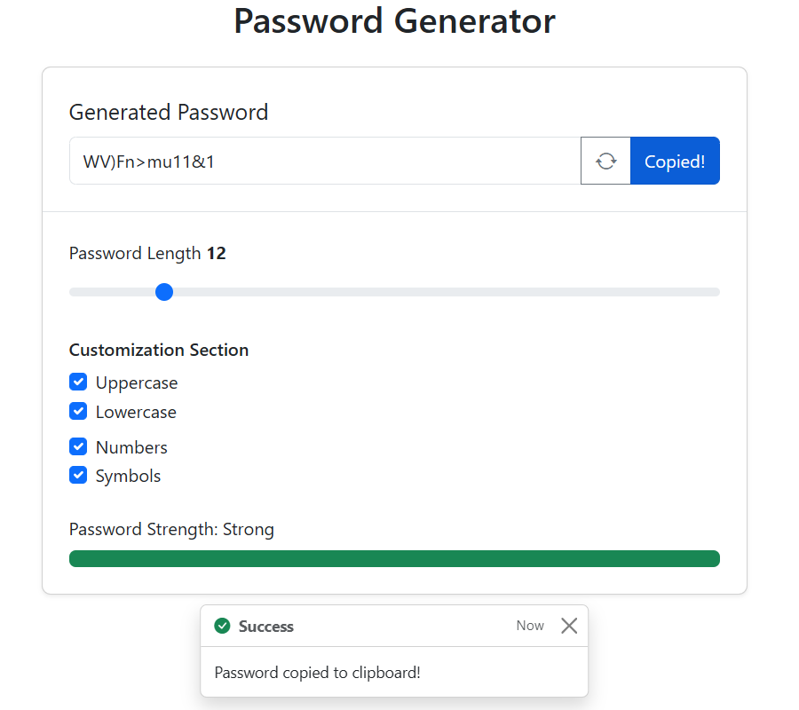
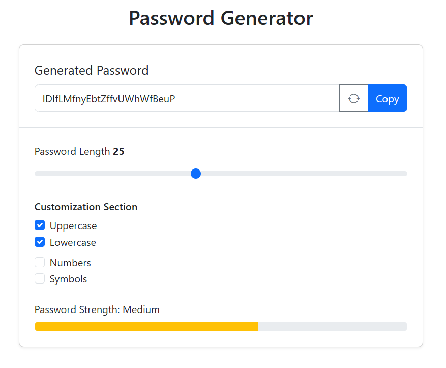

# 🔐 Random Password Generator

A secure, fully customizable password generator built with Vanilla JavaScript and Bootstrap 5. This tool allows users to generate strong passwords based on specific criteria and includes a visual strength indicator.

## 📸 Screenshots

| Strong Password (Full Complexity) | Medium Password (Letters Only) |
|:---:|:---:|
|  |  |

## ✨ Features

* **Customizable Length:** Slider controls password length from 6 to 50 characters.
* **Character Options:** Toggle uppercase, lowercase, numbers, and symbols independently.
* **Smart Generation:** The algorithm ensures at least one character from *each* selected category is included before filling the rest.
* **Strength Meter:** Real-time visual feedback (Red/Yellow/Green) based on password complexity and length.
* **One-Click Copy:** Copies the password to the clipboard and displays a Bootstrap Toast notification.
* **Responsive Design:** Fully responsive layout using Bootstrap 5.

## 🛠️ Technologies Used

* **HTML5**
* **Bootstrap 5.3.3** (CSS & JS components)
* **JavaScript (ES6+)** (DOM manipulation, Math.random, Clipboard API)

## 📂 Project Structure

```text
.
├── index.html      # Main UI with Bootstrap layout
└── script.js       # Password generation and strength logic

```

## 🚀 How to Run

1. Clone this repository.
2. Open `index.html` in any modern web browser.
3. Adjust the sliders and checkboxes to generate a password.
